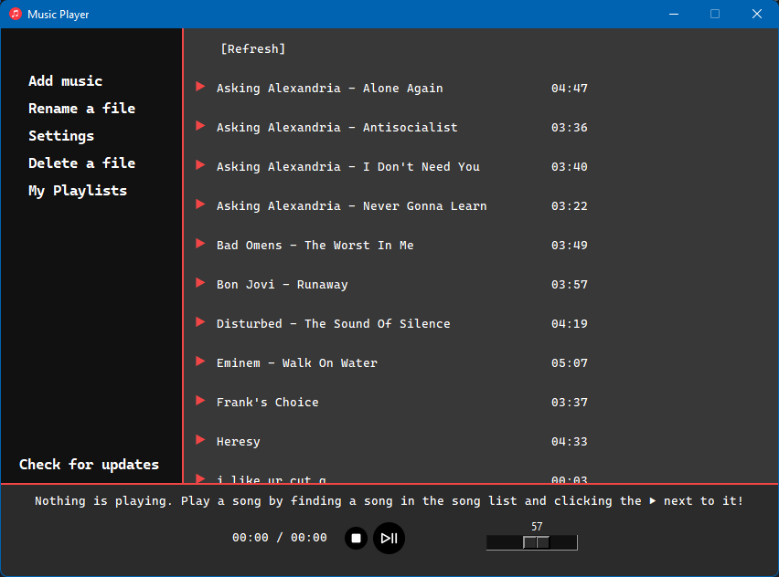

> [!NOTE]  
> The music player is being re-written in [iced-rs](https://github.com/iced-rs/iced) (Rust).

<h1 align="center">Music Player</h1>
<h3 align="center">A simple music player created using Python and Tkinter to play music (or any audio) on your computer!</h3>

<div style="text-align: center;">



</div>

## About
Site: https://acatiadroid.github.io/music-player-site/

This is a music player that lets you download music to your computer. It is made using Python and Tkinter.

Check out the releases to install onto your machine.

## How to run
You will need the following:
* Git
* Python 3.6 or later
* Enough disk space

#### Using run.py:
* Clone `origin/main` (don't use any other branch) and change into new directory:

```git clone https://github.com/acatiadroid/music-player & cd music-player```

* Install dependancies:

```pip install --upgrade -r requirements.txt```

* Run the `run.py` file in the root directory:

```python run.py```

## Help Guide
A help guide can be found in [misc/help.md](https://github.com/acatiadroid/music-player/blob/main/misc/help.md).

## Contributing
Contributions are welcome! Check out the [contributing guidelines](https://github.com/acatiadroid/wantstoparty/blob/main/.github/CONTRIBUTING.md) beforehand.

## License
This project is licensed under GPL-3.0 license, which can be found in the [LICENSE](https://github.com/acatiadroid/music-player/blob/main/LICENSE) file.

## Update Log
The update log can be found in the [misc/updates.md](https://github.com/acatiadroid/music-player/blob/main/misc/updates.md) directory.